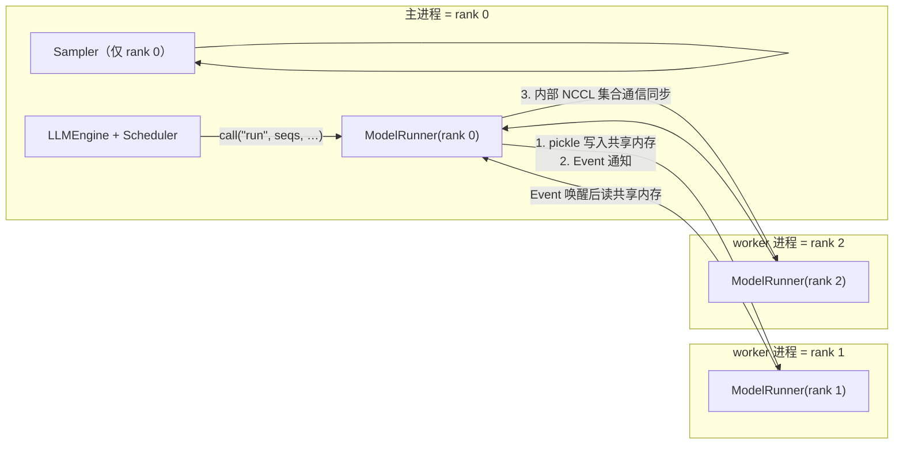
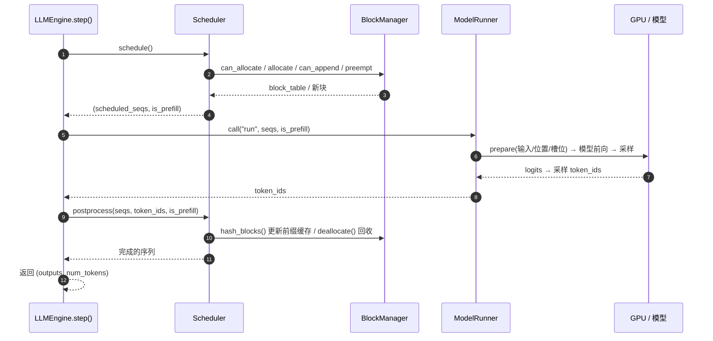

# 01 · 总体架构

## 1. 一句话概括

> Nano-vLLM = **调度器(Scheduler) + 分页显存管理器(BlockManager) + GPU 执行器(ModelRunner)**，由 `LLMEngine` 用一个 `while not finished: step()` 循环把三者串起来。

与训练代码（固定 batch、全量前向）不同，推理框架要回答的核心问题是：**当前 GPU 显存里，哪几个请求、以什么形状、计算哪些 token？** 调度器与 BlockManager 负责回答"哪几个请求、多大显存"，ModelRunner 负责把答案翻译成 GPU 上的张量运算。

## 2. 目录结构与模块职责

| 文件　　　　　　　　　　　　　　　　　　　　　　　　　　　　　 | 角色　　 | 关键职责　　　　　　　　　　　　　　　　　　　　　　　　　　　　　 |
| ----------------------------------------------------------------| ----------| --------------------------------------------------------------------|
| [llm.py](../nanovllm/llm.py)　　　　　　　　　　　　　　　　　 | 入口　　 | `LLM(LLMEngine)`，用户唯一接触的类　　　　　　　　　　　　　　　　 |
| [config.py](../nanovllm/config.py)　　　　　　　　　　　　　　 | 配置　　 | `Config` dataclass：batch 上限、KV 块大小、TP 规模、显存利用率　　 |
| [sampling_params.py](../nanovllm/sampling_params.py)　　　　　 | 配置　　 | 每请求的温度、最大生成长度、是否忽略 EOS　　　　　　　　　　　　　 |
| [engine/llm_engine.py](../nanovllm/engine/llm_engine.py)　　　 | **引擎** | 对外 `generate()`；对内 `step()` 主循环；TP 进程的创建者　　　　　 |
| [engine/scheduler.py](../nanovllm/engine/scheduler.py)　　　　 | **调度** | 维护 `waiting`/`running` 队列；prefill 与 decode 两阶段调度；抢占　|
| [engine/block_manager.py](../nanovllm/engine/block_manager.py) | **显存** | 固定大小 KV 块分配/释放；哈希前缀缓存　　　　　　　　　　　　　　　|
| [engine/sequence.py](../nanovllm/engine/sequence.py)　　　　　 | 数据　　 | `Sequence`：请求的 token 容器 + 状态机；`SequenceStatus`　　　　　 |
| [engine/model_runner.py](../nanovllm/engine/model_runner.py)　 | **执行** | 模型前向；KV Cache 划分配置；CUDA Graph 捕获；多卡 worker 进程　　 |
| [models/qwen3.py](../nanovllm/models/qwen3.py)　　　　　　　　 | 模型　　 | Qwen3 解码器 + 因果 LM 头　　　　　　　　　　　　　　　　　　　　　|
| [layers/](../nanovllm/layers/)　　　　　　　　　　　　　　　　 | 算子　　 | 注意力、并行线性层、RMSNorm、RoPE、嵌入/LM 头、采样器　　　　　　　|
| [utils/context.py](../nanovllm/utils/context.py)　　　　　　　 | 元数据　 | `Context` 全局对象：携带每步的 cu_seqlens/slot_mapping/block_table |
| [utils/loader.py](../nanovllm/utils/loader.py)　　　　　　　　 | 权重　　 | 读取 safetensors，按"打包映射 + TP 分片"写入参数　　　　　　　　　 |

## 3. 整体组件协作图

一次 `generate()` 调用中，主进程每调用一次 `step()`，就完成「调度 → 执行 → 后处理」的闭环。引擎侧的方框（LLMEngine / Scheduler / BlockManager / ModelRunner）与 `engine/` 下的文件一一对应；GPU 侧是模型与算子：

```mermaid
flowchart TB
    User([用户代码]) -->|prompts + SamplingParams| LLM

    subgraph CPU["LLMEngine 主进程 —— 调度层"]
        LLM["LLMEngine<br/>generate() → step() 主循环"]
        Sched["Scheduler<br/>waiting / running 队列"]
        BM["BlockManager<br/>KV 块池 + 前缀哈希表"]
    end

    subgraph GPU["GPU —— 执行层（每个 TP rank 一份）"]
        MR["ModelRunner<br/>prepare → run_model → sample"]
        Model["Qwen3ForCausalLM<br/>embed → N×DecoderLayer → lm_head"]
        Attn["Attention<br/>store_kvcache + flash-attn"]
        KV[("Paged KV Cache<br/>[2, L, num_blocks, B, n_kv_h, d]")]
        Smp["Sampler（仅 rank 0）"]
    end

    Ctx(("Context 全局单例<br/>cu_seqlens / slot_mapping / block_tables"))

    %% ① 调度：决定本步算哪些请求、占多大显存
    LLM -->|add_request 入队| Sched
    LLM -->|step: schedule| Sched
    Sched -->|can_allocate · allocate<br/>can_append · preempt| BM
    Sched -->|seqs, is_prefill| LLM

    %% ② 执行：把调度结果翻译成 GPU 上的张量运算
    LLM -->|call'(&quot;run&quot;, seqs, is_prefill')| MR
    MR -.->|prepare_* 写入元数据| Ctx
    Ctx -.->|get_context() 读取| Attn
    MR -->|input_ids / positions| Model
    Model -->|逐层前向| Attn
    Attn -->|store_kvcache / flash-attn 读写| KV
    Model -->|logits| Smp
    Smp -->|token_ids| MR

    %% ③ 后处理：推进序列状态、回收并哈希缓存
    MR -->|token_ids| LLM
    LLM -->|postprocess(seqs, token_ids, …)| Sched
    Sched -->|hash_blocks · deallocate| BM
```

**数据流的关键点**：`Sequence`（含 block_table）从 Scheduler 流出，经 `step()` 交给 ModelRunner；ModelRunner 把「哪些请求、哪些 token」翻译成 GPU 张量（`input_ids / positions / slot_mapping / block_tables`）并写入全局单例 `Context`，模型前向时注意力算子 `get_context()` 据此读写分页 KV Cache，最后 rank 0 采样出新 token，流回 Scheduler 更新状态。三个阶段的编排完全由 `LLMEngine.step()` 完成。

## 4. 进程 / 多卡模型

`tensor_parallel_size = N` 时，`LLMEngine.__init__` 会创建 **N-1 个独立进程**（`mp.get_context("spawn")`），加上主进程共 N 个进程，每个进程一个 rank、一块 GPU。



- **指令传递**：rank 0 调用 `ModelRunner.call()`，先把 `[方法名, 参数]` pickle 后写入一块 `SharedMemory`，再 `Event.set()` 通知所有 worker；worker 在 `loop()` 里 `Event.wait()` 被唤醒后读取并执行同一方法。见 [model_runner.py:61-89](../nanovllm/engine/model_runner.py#L61-L89)。
- **数据同步**：方法内部靠 NCCL 集合通信（`RowParallelLinear` 的 `all_reduce`、LM head 的 `gather` 等）保证各 rank 同步，见 [05-model-execution.md](05-model-execution.md)。
- **序列精简序列化**：传给 worker 的 `Sequence` 用自定义 `__getstate__`/`__setstate__` 只传必要字段（decode 阶段只传最后一个 token），减少 IPC 拷贝。见 [sequence.py:72-84](../nanovllm/engine/sequence.py#L72-L84)。
- `tensor_parallel_size = 1` 时不 spawn 任何进程，也没有共享内存开销，全部在主进程完成。

## 5. 一次 step() 内部的分工

每个 step 是引擎的最小原子操作，五步闭环：



其中 `num_tokens` 的约定（[llm_engine.py:51](../nanovllm/engine/llm_engine.py#L51)）很有意思：
- prefill 步返回 **正数**：本步处理的输入 token 总数（吞吐 = token/s）；
- decode 步返回 **负数**：`-len(seqs)`，即解码了多少次采样。

主循环用这个正负号区分"此刻在算 prefill 还是 decode"，分别统计两种吞吐。

## 6. 设计上值得注意的约定

1. **KV 块大小固定为 256**（`kvcache_block_size`，与 vLLM 默认一致），块在显存中是连续的 `[num_blocks, block_size, num_kv_heads, head_dim]` 张量切片。
2. **上下文元数据不随张量走**，而是塞进全局单例 `Context`（[utils/context.py](../nanovllm/utils/context.py)）。模型前向时各层通过 `get_context()` 拿到本步的 `cu_seqlens`、`slot_mapping`、`block_tables` 等。这是为了把 CUDA Graph 捕获时"元数据形状固定"的需求与动态调度解耦。
3. **采样只在 rank 0 进行**：`prepare_sample` 与 `sampler(...)` 都带 `if self.rank == 0` 守卫（[model_runner.py:216-218](../nanovllm/engine/model_runner.py#L216-L218)），因为 LM head 已把全量 logits `gather` 到 rank 0。
4. **内存分配是"拍脑袋"的**：KV Cache 总量 = `总显存 × gpu_memory_utilization - 当前已用 - warmup峰值`,见 [04-paged-kvcache.md](04-paged-kvcache.md) 第 2 节。
