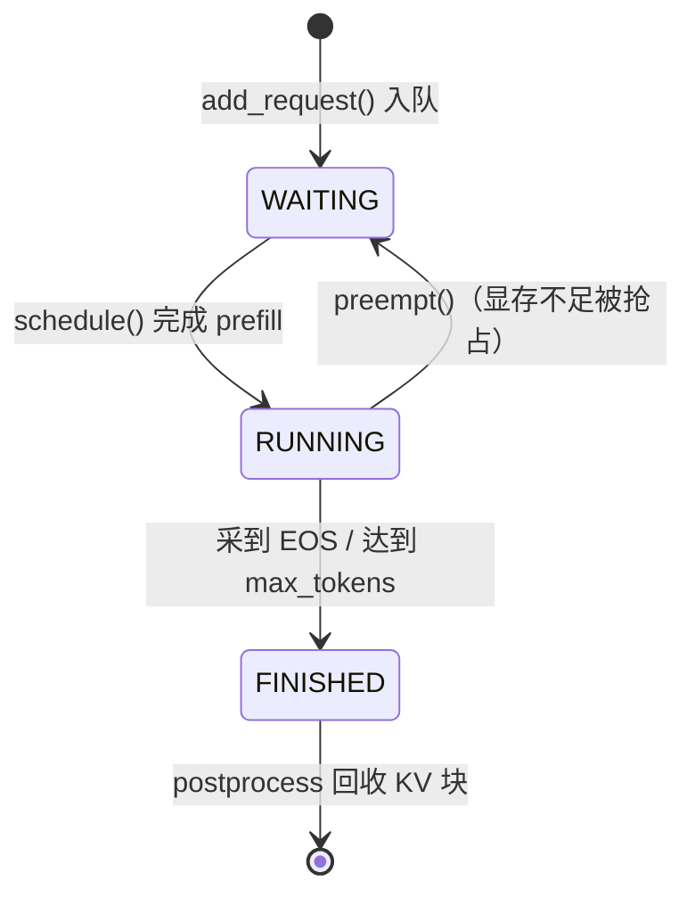
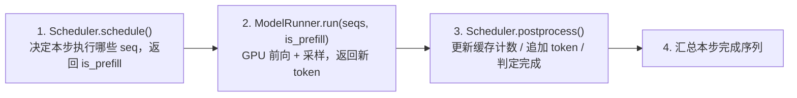
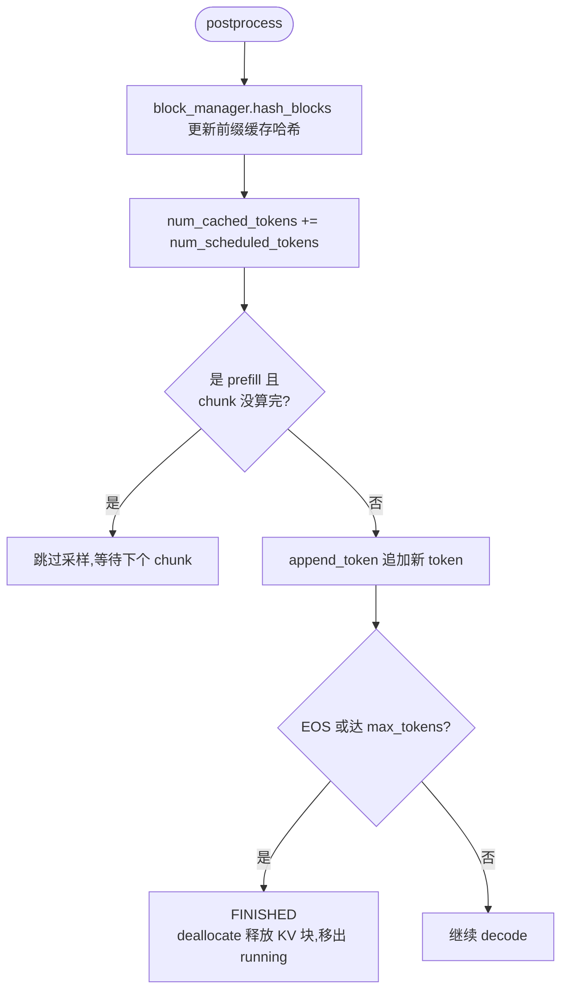

# 02 · 请求生命周期与主循环

## 1. 请求状态机

一个请求从进入引擎到返回结果，经历三种状态（[sequence.py:8-11](../nanovllm/engine/sequence.py#L8-L11)）：



- **WAITING**：已加入 `scheduler.waiting` 队列，等待 prefill（还没有任何 KV 落盘）。
- **RUNNING**：前缀已预填充完毕，进入 `running` 队列，每步 decode 一个 token。
- **FINISHED**：`postprocess` 里发现新 token 是 EOS（且未忽略 EOS）或生成长度到 `max_tokens`，立即 `deallocate` 释放 KV 块，并从 `running` 队列移除。

`Sequence` 对象的核心字段（[sequence.py:18-31](../nanovllm/engine/sequence.py#L18-L31)）：

| 字段 | 含义 |
|------|------|
| `token_ids` | 全部 token（prompt + 已生成部分），`append_token()` 追加 |
| `num_prompt_tokens` | 本次请求的 prompt 长度（用于区分 completion） |
| `num_tokens` | 当前总长度 = prompt + 已生成 |
| `num_cached_tokens` | **已有 KV 落盘的 token 数**（prefill 进度指针） |
| `num_scheduled_tokens` | 本 step 计划执行的 token 数 |
| `block_table` | 该请求占用的物理 KV 块 id 列表 |
| `is_prefill` | 是否仍处于 prefill 阶段 |

## 2. generate() 总流程

用户侧只看到两个 API：`LLM(path)` 与 `llm.generate(prompts, sp)`。内部是"**先全部入队，再同步跑完**"：

```mermaid
flowchart TB
    Start([llm.generate]) --> T1[for 每个 prompt:<br/>tokenizer.encode → Sequence<br/>scheduler.add 加入 waiting 队列]
    T1 --> T2{is_finished?<br/>waiting 和 running 都空?}
    T2 -->|否| T3[step 一次]
    T3 --> T4{本步有序列完成?}
    T4 -->|是| T5[记录 outputs[seq_id] = 生成的 token_ids]
    T4 -->|否| T6[继续]
    T5 --> T2
    T6 --> T2
    T2 -->|是| T7[按 seq_id 排序<br/>tokenizer.decode 还原文本]
    T7 --> Ret([返回 [{text, token_ids}, …]])
```

> 注意：`generate()` 是**同步阻塞**的，且**一次性接收所有请求**。这与 vLLM 的 `LLM.generate` 一致——批量进来、一起调度。真正的"动态"发生在每步 `schedule()` 内部（见下一节）。

## 3. step()：引擎的心跳

`step()`（[llm_engine.py:49-55](../nanovllm/engine/llm_engine.py#L49-L55)）是每轮迭代的四个动作：



**① schedule()** —— 见 [03-scheduler.md](03-scheduler.md)。优先做 prefill（把新请求的前缀算完），prefill 预算耗尽或没有等待请求时改做 decode（给 running 中的请求各算下一个 token）。

**② run()** —— 见 [05-model-execution.md](05-model-execution.md)。prefill 与 decode 的输入组织方式完全不同（变长批 vs 单 token 批），`is_prefill` 决定走哪条准备路径。

**③ postprocess()** —— 每个被调度的序列拿到一个采样 token：



## 4. 主循环的吞吐统计

`generate()` 用 `perf_counter` 逐 step 计时，根据 `num_tokens` 的**正负号**区分当前是 prefill 还是 decode，实时展示两种吞吐（[llm_engine.py:72-83](../nanovllm/engine/llm_engine.py#L72-L83)）：

| 阶段 | num_tokens | 吞吐公式 | 物理含义 |
|------|-----------|---------|---------|
| prefill | `Σ num_scheduled_tokens > 0` | 处理 token 数 / 耗时 | 首 token 生成延迟（TTFT）的关键 |
| decode | `-len(seqs) < 0` | 序列数 / 耗时 | 每步采几个 token，即 ITL / 并发度 |

`tqdm` 的进度条按"完成序列数 / 总请求数"推进，与 vLLM 的 benchmark 展示风格一致。

## 5. 关键学习点

1. **调度与执行分离**：`step()` 里调度器只做"决策"，ModelRunner 只做"执行"，决策与执行之间只传递轻量的 `Sequence` 列表。这让两种耗时解耦——调度是 CPU 毫秒级，执行是 GPU 毫秒级。
2. **prefill 一次、decode 多次**：一个请求只在最初被 `schedule()` 选中一次做 prefill，之后每步 decode 一个 token，直到完成或被抢占。
3. **负号 trick**：用一个正负数同时传递"执行了什么阶段"和"做了多少"，是精简代码的典型手法。
