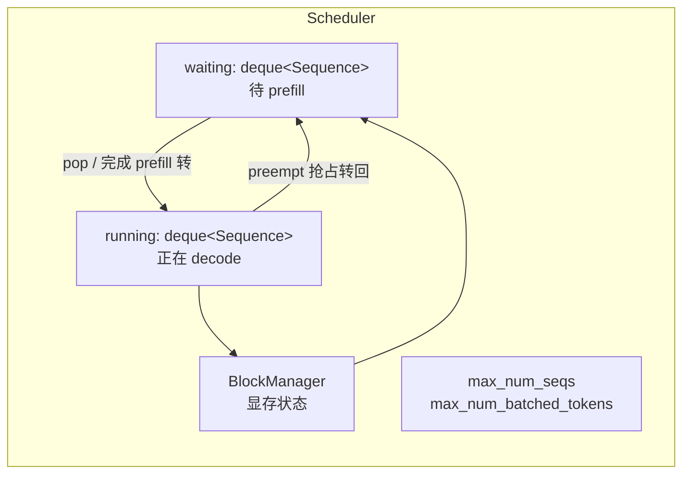
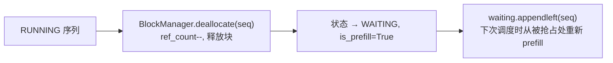

# 03 · 调度器 Scheduler

## 1. 为什么需要调度器

GPU 每次前向的耗时基本固定，因此**每步处理的 token 总量**决定吞吐。调度器要做的事是：在 `max_num_batched_tokens`（本步最多算多少 token）与 `max_num_seqs`（本步最多几个请求）两个硬约束下，**每步尽量装满**，同时保证"显存够用"。

Nano-vLLM 的调度器只有约 90 行，但包含了 vLLM 的核心策略：**prefill 优先、chunked prefill、decode 批、抢占**。

## 2. 数据结构



- `waiting` / `running` 都是 **双端队列**（[scheduler.py:16-17](../nanovllm/engine/scheduler.py#L16-L17)），支持从两端进出，配合"抢占后放回队首"。
- 每次 `schedule()` 先尝试 prefill（从 `waiting` 头部取），如果没有可 prefill 的，再尝试 decode（从 `running` 头部取）。

## 3. schedule() 总体流程图

```mermaid
flowchart TD
    S([schedule]) --> A[scheduled_seqs = []; num_batched_tokens = 0]

    A --> B["阶段一: prefill<br/>while waiting 非空 且 len &lt; max_num_seqs"]
    B --> B1{本步 token 预算耗尽?}
    B1 -->|是| D
    B1 -->|否| B2{seq 是否首次 prefill?}
    B2 -->|是| B3["BlockManager.can_allocate(seq)<br/>查前缀缓存 + 检查空闲块"]
    B3 --> B4{返回 -1?<br/>空闲块不足}
    B4 -->|是| D
    B4 -->|否| B5["num_tokens = seq.num_tokens - 缓存块×block_size<br/>（跳过已缓存的公共前缀）"]
    B2 -->|否| B6["num_tokens = seq.num_tokens - num_cached_tokens<br/>（chunked prefill 续跑）"]
    B5 --> C{剩余预算 &lt; num_tokens 且已调度了别的 seq?}
    B6 --> C
    C -->|是| D["只允许第一个 seq 做 chunked prefill<br/>跳出 prefill 阶段"]
    C -->|否| C1[allocate 建立 block_table]
    C1 --> C2["num_scheduled_tokens = min(num_tokens, 剩余预算)"]
    C2 --> C3{这个 seq 的 prefill 完成?}
    C3 -->|是| C4[状态转 RUNNING<br/>waiting → running]
    C3 -->|否| C5[仍是 WAITING,下个 chunk 再继续]
    C4 --> C6[scheduled_seqs 追加该 seq]
    C5 --> C6
    C6 --> B

    D --> E{scheduled_seqs 非空?}
    E -->|是| F1[返回 seqs, is_prefill=True<br/>本步执行 prefill]
    E -->|否| G["阶段二: decode<br/>while running 非空 且 len &lt; max_num_seqs"]
    G --> G1{can_append 需要新块但没空闲块?}
    G1 -->|是| G2[抢占 running 队尾的 seq 释放显存]
    G2 --> G1
    G1 -->|否| G3["num_scheduled_tokens = 1<br/>may_append 按需分配新块<br/>加入 scheduled_seqs"]
    G3 --> G
    G --> F2[返回 seqs, is_prefill=False<br/>本步执行 decode]
```

## 4. 阶段一：prefill（含前缀缓存与 chunked prefill）

关键代码：[scheduler.py:29-55](../nanovllm/engine/scheduler.py#L29-L55)

```python
while self.waiting and len(scheduled_seqs) < self.max_num_seqs:
    seq = self.waiting[0]
    remaining = self.max_num_batched_tokens - num_batched_tokens
    if remaining == 0: break
    if not seq.block_table:                                  # 首次 prefill
        num_cached_blocks = self.block_manager.can_allocate(seq)
        if num_cached_blocks == -1: break                    # 显存不够
        num_tokens = seq.num_tokens - num_cached_blocks * self.block_size
    else:                                                    # chunked prefill 续跑
        num_tokens = seq.num_tokens - seq.num_cached_tokens
    if remaining < num_tokens and scheduled_seqs:            # 只允许第一个 seq chunk
        break
    if not seq.block_table:
        self.block_manager.allocate(seq, num_cached_blocks)
    seq.num_scheduled_tokens = min(num_tokens, remaining)
    num_batched_tokens += seq.num_scheduled_tokens
    if seq.num_cached_tokens + seq.num_scheduled_tokens == seq.num_tokens:
        seq.status = SequenceStatus.RUNNING                  # prefill 完成
        self.waiting.popleft(); self.running.append(seq)
    scheduled_seqs.append(seq)
```

三个要点：

1. **前缀缓存裁剪**：若 `can_allocate` 发现请求的公共前缀已在缓存中（返回 `num_cached_blocks`），则本步只需计算"跳过缓存块之后的剩余 token"，这就是 `num_tokens = seq.num_tokens - 缓存块×256` 的含义。缓存的 KV 通过 `block_table` 直接复用，见 [04-paged-kvcache.md](04-paged-kvcache.md)。
2. **Chunked prefill**：长 prompt 一次装不进 `max_num_batched_tokens` 时，切成多段，每 step 算一段。被切分后 `block_table` 非空、状态仍为 WAITING，下个 step 从 `waiting` 队首继续，此时走 `else` 分支。**只有队首第一个 seq 允许被切**（`if remaining < num_tokens and scheduled_seqs: break`），避免多个半截 prefill 互相穿插导致 GPU 利用率碎片化。
3. **显存不足即停**：`can_allocate == -1` 时直接 `break`，把剩下的 prefill 留到后续 step——本轮转去执行 decode，不让 GPU 空转。

## 5. 阶段二：decode

关键代码：[scheduler.py:57-73](../nanovllm/engine/scheduler.py#L57-L73)

```python
while self.running and len(scheduled_seqs) < self.max_num_seqs:
    seq = self.running.popleft()
    while not self.block_manager.can_append(seq):            # 需要新块但没空闲块
        if self.running:
            self.preempt(self.running.pop())                 # 先抢队尾的
        else:
            self.preempt(seq); break                         # 只能抢自己
    else:
        seq.num_scheduled_tokens = 1
        seq.is_prefill = False
        self.block_manager.may_append(seq)                   # 按需分配新块
        scheduled_seqs.append(seq)
self.running.extendleft(reversed(scheduled_seqs))            # 放回队首，保序
```

- **decode 批**：`running` 中每个序列本步采样 1 个 token，批大小 = 并发序列数。
- **can_append**：只有序列长度跨过块边界（`len % block_size == 1`）才真的需要新块，此时若 `free_block_ids` 不足，就通过 `preempt` 抢占腾空间。
- **抢占策略**：优先抢 `running` **队尾**（`pop()` 从右端取，即最早进入 running、最近一轮最晚被服务的序列），因为它的块可以被最安全地回收；若只剩自己，就抢占自己（放弃本轮 decode，回到 waiting 重新 prefill）。
- `extendleft(reversed(...))` 保证本轮被调度的序列仍按原顺序排在队首。

## 6. 抢占 preempt

[preempt()](../nanovllm/engine/scheduler.py#L75-L79)：把 RUNNING 序列打回 WAITING，**释放其全部 KV 块**：



注意：抢占后 `num_cached_tokens` 归零、`block_table` 清空（[block_manager.py:94-101](../nanovllm/engine/block_manager.py#L94-L101)），该序列会**从头开始 prefill**——但因为前缀缓存的存在，如果它的前缀之前已被其他请求算过，`can_allocate` 能直接复用，实际损失有限。

## 7. postprocess：调度后的状态回写

[postprocess()](../nanovllm/engine/scheduler.py#L81-L92) 与 `schedule` 配对：把执行结果写回调度器。

1. `hash_blocks(seq)`：为前缀缓存登记本步新填满的块（见 [04-paged-kvcache.md](04-paged-kvcache.md) §5）。
2. `num_cached_tokens += num_scheduled_tokens`：推进"已落盘 KV"指针。
3. 若 `is_prefill` 且 chunk 未算完 → `continue`，不采样（该 seq 本轮不产生新 token）。
4. 否则 `append_token(token_id)`，并检查 EOS / max_tokens 判定完成。

## 8. 学习要点

1. **"预算-序列数"双上限**是连续批处理的核心：`max_num_batched_tokens` 约束每步 GPU 算力上限，`max_num_seqs` 约束注意力/采样批次上限。
2. **prefill 优先 + 抢占兜底**：只要还有新请求就优先喂 prefill（降低 TTFT），显存不够就把已 running 的踢出去，保证 GPU 每步都满载。
3. **chunked prefill 只有一个 seq 可以切**，这是 Nano-vLLM 的简化设计——vLLM 允许任意组合，但会带来更复杂的调度决策。
