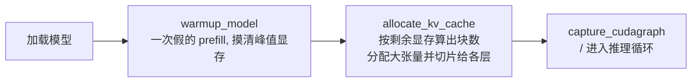
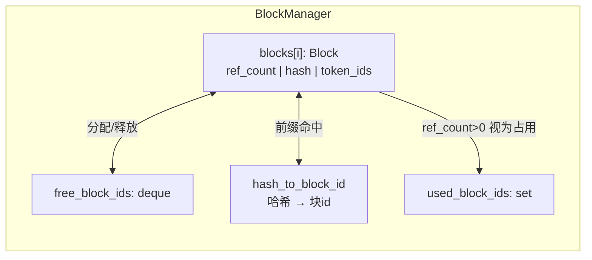
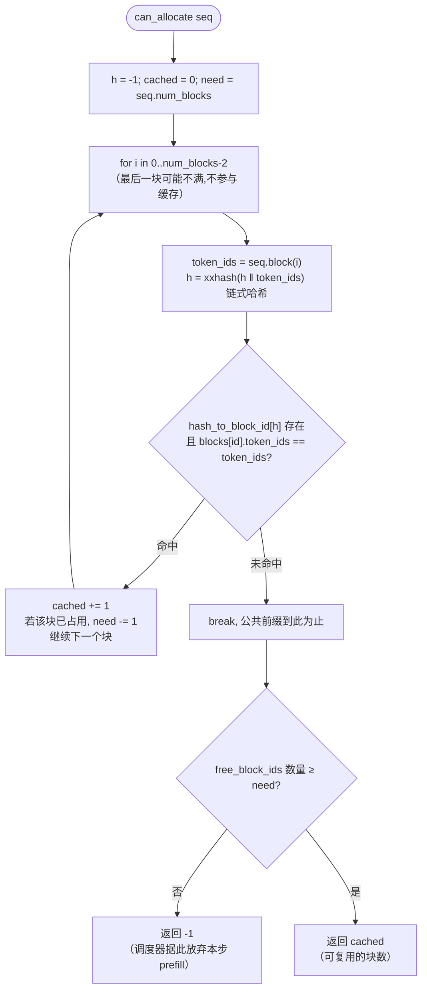
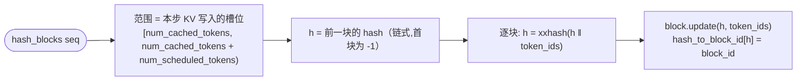
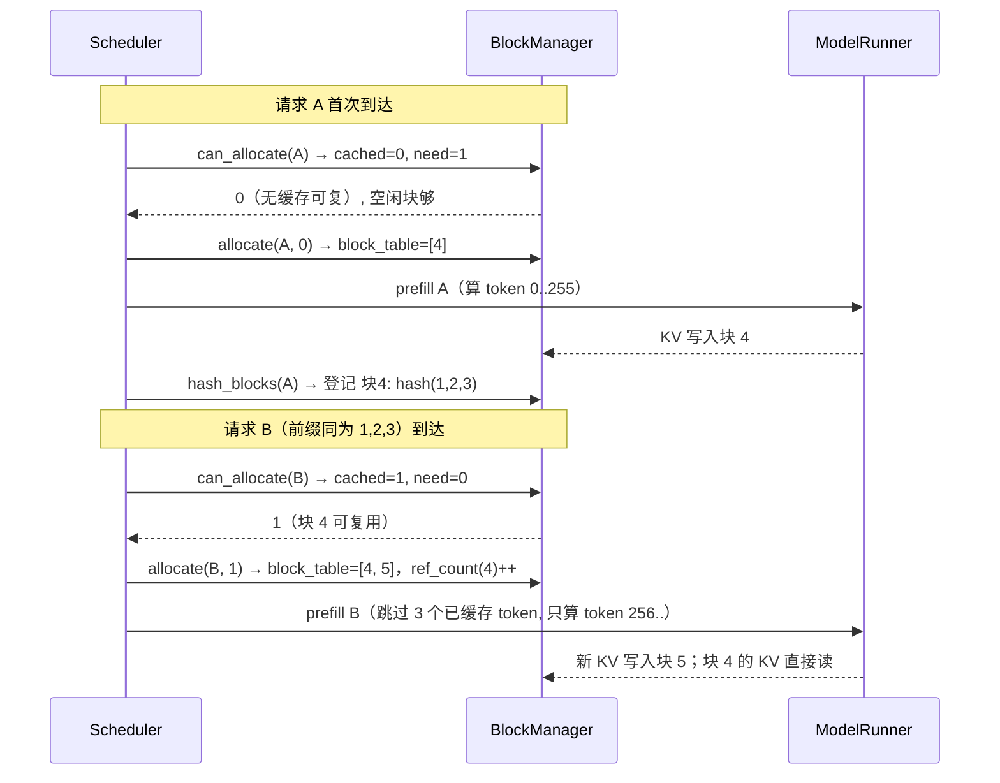

# 04 · Paged KV Cache 与 BlockManager

## 1. 为什么 KV Cache 需要"分页"

自回归解码每生成一个 token，就要把该位置计算出的 K/V 向量存下来，供后续所有 token 的注意力查询。如果不做管理，每请求独占一段连续显存，长度动态增长必然造成大量碎片与浪费。**分页 KV Cache** 的思想与操作系统的虚拟内存分页一致：

> 逻辑上连续的序列，映射到物理上离散的**固定大小块**（本实现 `block_size = 256`）。序列只维护一个 `block_table`（块号列表），新增 token 时按需申请新块。

```mermaid
flowchart LR
    subgraph Logical[逻辑视角: 序列 A 的 token 流]
        direction LR
        LA["token 0..255<br/>块A0"] --> LB["token 256..511<br/>块A1"] --> LC["token 512..<br/>块A2(部分填充)"]
    end
    subgraph Physical[物理 KV Cache]
        direction LR
        P0["块 7"] P1["块 3"] P2["块 12"]
    end
    LA -.-> P0
    LB -.-> P1
    LC -.-> P2
    Note["序列 A 的 block_table = [7, 3, 12]"]
```

## 2. KV Cache 内存布局与分配

KV Cache 是一块**连续的大张量**（[model_runner.py:103-121](../nanovllm/engine/model_runner.py#L103-L121)）：

```text
kv_cache: [2, num_hidden_layers, num_kvcache_blocks, block_size, num_kv_heads, head_dim]
           │   │                │                │          │            └── 每个头每维一个数
           │   │                │                │          └── 每块内的 token 数 (256)
           │   │                │                └── 物理块总数
           │   │                └── 每个注意力层一片
           │   └── K 与 V 各一份
           └── 维度 0: K-cache / V-cache
```

每个注意力层拿到自己的切片：`layer.k_cache = kv_cache[0, layer_id]`，`layer.v_cache = kv_cache[1, layer_id]`。

**块总量按"剩余显存"动态计算**（[model_runner.py:110-114](../nanovllm/engine/model_runner.py#L110-L114)）：

```python
num_kv_heads = hf_config.num_key_value_heads // world_size      # 每个 rank 负责的头数
block_bytes = 2 * num_hidden_layers * block_size * num_kv_heads * head_dim * dtype.itemsize
config.num_kvcache_blocks = int(total * gpu_memory_utilization - used - peak + current) // block_bytes
```

即：目标占用 `总显存 × 0.9` − 当前已用（warmup 峰值减去当前 = 即将释放的临时内存），再除以单块字节数。**模型先加载、warmup 之后**才分配 KV Cache，保证权重与中间张量已有空间。



## 3. BlockManager 数据结构

[block_manager.py:26-33](../nanovllm/engine/block_manager.py#L26-L33) 用四样东西管理所有块：

| 结构 | 类型 | 含义 |
|------|------|------|
| `blocks` | `list[Block]` | 所有物理块（下标即块 id）；每个 Block 记录 `ref_count`、内容哈希 `hash`、内容 `token_ids` |
| `hash_to_block_id` | `dict[int, int]` | **前缀缓存表**：块内容哈希 → 块 id |
| `free_block_ids` | `deque[int]` | 空闲块池（deque，取块很快） |
| `used_block_ids` | `set[int]` | 已被占用的块 id |



## 4. 分配流程：can_allocate → allocate

**can_allocate**（[block_manager.py:58-73](../nanovllm/engine/block_manager.py#L58-L73)）做两件事：① 沿前缀逐块算哈希查缓存，数出能复用的块；② 检查剩余空闲块是否够分配新块。



**allocate**（[block_manager.py:75-92](../nanovllm/engine/block_manager.py#L75-L92)）按 can_allocate 的结果建立 `block_table`：

1. 前 `num_cached_blocks` 个块复用缓存：`ref_count += 1`（若在 free 池则移出、置 1）。
2. 剩余块从 `free_block_ids` 逐个弹出（`_allocate_block`），`ref_count` 置 1。
3. `seq.num_cached_tokens = num_cached_blocks * block_size`：标记前缀部分 KV 已就绪。

> `ref_count` 支持**块共享**：两个前缀相同的请求可以同时引用同一物理块（只有占用状态的块会被 `can_allocate` 计数为需要新块）。释放时 `ref_count` 归零才真正回收。

## 5. 解码过程中的按需扩块

序列每步只新增 1 个 token。`can_append`（[block_manager.py:103-104](../nanovllm/engine/block_manager.py#L103-L104)）判断是否需要新块：

```python
def can_append(self, seq):
    return len(self.free_block_ids) >= (len(seq) % self.block_size == 1)
```

只有 `len(seq) % 256 == 1`（长度刚好越界，新 token 要进入新块）时才需要 1 个空闲块。`may_append` 在此时为新块申请块号并追加进 `block_table`。

## 6. 前缀缓存：hash_blocks 登记新内容

每次 `postprocess` 调用 `hash_blocks`（[block_manager.py:110-120](../nanovllm/engine/block_manager.py#L110-L120)），把本步**新填满的块**的内容登记进 `hash_to_block_id`：



**哈希是链式的**：块 i 的哈希依赖块 i-1 的哈希，因此只要两块之间任何一个 token 不同，后续哈希必然不同——公共前缀天然地被哈希链锁定，且计算很快（`xxhash` + numpy 序列化）。

**防碰撞校验**：`can_allocate` 命中哈希后还会比较 `blocks[id].token_ids != token_ids` 做内容确认，避免哈希碰撞导致错误复用。

**时序的细节**：登记发生在本步 token `append` 之前、但哈希用到 `token_ids` 已包含到 `num_cached_tokens` 为止的全部内容，正好与 KV 落盘的槽位对齐（详见 [03-scheduler.md](03-scheduler.md) §7）。前缀缓存由此能跨请求、跨抢占复用——**被抢占的请求重新 prefill 时，只要前缀哈希还在，就不用重算**。

## 7. 前缀缓存在一次调度中的完整链路

以两个请求为例：请求 A（前缀 `[1,2,3]`）已算完，请求 B 前缀同为 `[1,2,3]`：



请求 B 只计算了自己独有的部分，公共前缀的 prefill 计算被完全跳过。

## 8. 学习要点

1. **分页的意义** = 消除"按请求预留整段连续显存"的浪费 + 让"块"成为可共享、可回收的最小显存单元。
2. **ref_count 是共享的基础**：块级引用计数让前缀复用、抢占释放、请求完成回收三件事都变成 O(1) 的计数操作。
3. **链式哈希 + 内容校验** 是轻量级前缀缓存的标准做法（vLLM 的实现思路类似，只是哈希更复杂）。
4. **最后一块不参与缓存**：因为块不满时无法确定其完整内容是否与未来请求一致，保守跳过更安全。
