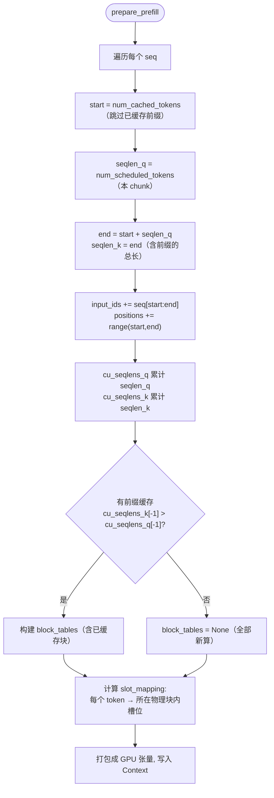
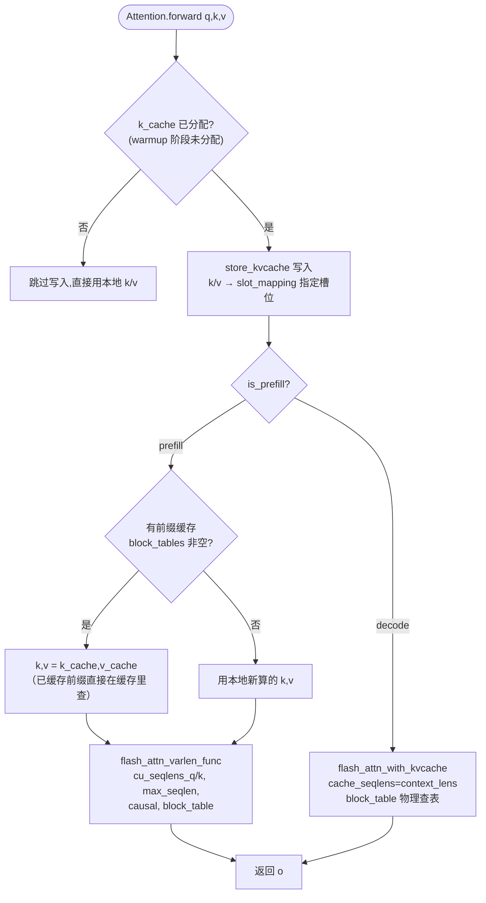
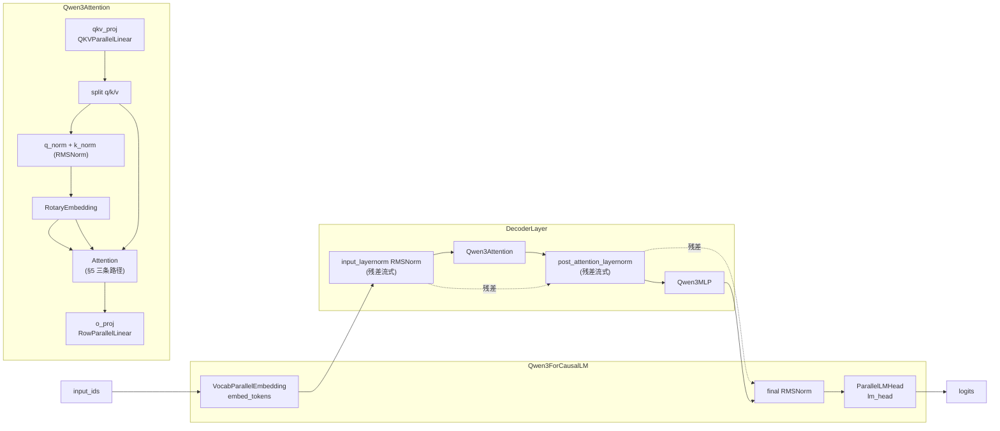
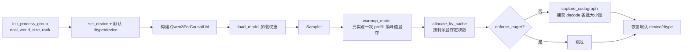

# 05 · 模型执行 ModelRunner 与数据组织

## 1. ModelRunner 的职责

ModelRunner（[model_runner.py](../nanovllm/engine/model_runner.py)）是引擎的 **GPU 侧执行器**，负责：

1. 初始化：建模型 → 加载权重 → warmup → 分配 KV Cache → 捕获 CUDA Graph；
2. 每次 `run()`：把调度器送来的 `Sequence` 列表翻译成 GPU 张量（输入/位置/槽位/块表）；
3. 执行前向 + 采样，返回新 token。

它的 `run(seqs, is_prefill)` 是引擎主循环唯一调用的 GPU 入口：

```python
def run(self, seqs, is_prefill):
    input_ids, positions = self.prepare_prefill(seqs) if is_prefill else self.prepare_decode(seqs)
    temperatures = self.prepare_sample(seqs) if self.rank == 0 else None
    logits = self.run_model(input_ids, positions, is_prefill)
    token_ids = self.sampler(logits, temperatures).tolist() if self.rank == 0 else None
    reset_context()
    return token_ids
```

## 2. prefill 与 decode 的输入组织差异

同一个 `run_model`，prefill 与 decode 喂给注意力的张量形状完全不同：

| | **prefill** | **decode** |
|---|---|---|
| 每个请求算几个 token | 多个（chunk 长度） | 恰好 1 个 |
| `input_ids` | 拼接所有 chunk 的 token | 每请求最后一个 token |
| `positions` | 每 token 的真实位置（含前缀偏移） | `len(seq) - 1` |
| 注意力形态 | 变长批 → `flash_attn_varlen_func` | 单 token 批 → `flash_attn_with_kvcache` |
| 新增 KV 槽位 | `slot_mapping` 覆盖 chunk 每个 token | 单个槽位 |
| 已见 KV | `cu_seqlens_k` / `block_tables` | `context_lens` / `block_tables` |

## 3. prepare_prefill：变长批组织

[prepare_prefill](../nanovllm/engine/model_runner.py#L129-L170) 为每个 seq 计算一段 token，然后**拼接**成一个长张量，同时记录每个 seq 的边界：



**关键张量解释**（都通过 `Context` 传给注意力）：

- `cu_seqlens_q`：各 seq 新算 token 数的前缀和 → 告诉 varlen 注意力 Q 的每个片段边界。
- `cu_seqlens_k`：各 seq 总长（缓存 + 新算）的前缀和 → K/V 的片段边界。有前缀缓存时二者不同。
- `slot_mapping`：每个新 token 的 KV 该写到哪个物理槽位（`块id×256 + 块内偏移`），供 `store_kvcache` 写入。
- `block_tables`：物理块表，`flash_attn_varlen_func` 用它从 KV Cache 里**按块 gather** 前缀部分。

## 4. prepare_decode：单 token 批组织

[prepare_decode](../nanovllm/engine/model_runner.py#L172-L188) 更简单，每请求只取最后 1 个 token：

```python
input_ids.append(seq.last_token)                 # 上次采样的 token
positions.append(len(seq) - 1)                   # 它的位置
context_lens.append(len(seq))                    # 该 seq 当前总长 = 缓存中已见 KV 数
slot_mapping.append(seq.block_table[-1] * self.block_size + seq.last_block_num_tokens - 1)
```

- 解码时模型看到的是"最后一个 token"，输出预测"下一个 token"。
- `context_lens` 告诉 `flash_attn_with_kvcache` 每个序列在缓存里有多少个 token 可查。
- `slot_mapping` 指向新 KV 的写入槽位 = 最后一块的起点 + 最后一块内的偏移（`last_block_num_tokens - 1`）。

## 5. Attention：prefill / decode / 前缀缓存三条路径

[attention.py:59-75](../nanovllm/layers/attention.py#L59-L75) 把 `Context` 里的元数据翻译成 flash-attention 调用：



**写入为什么走 triton 内核**：`store_kvcache`（[attention.py:33-40](../nanovllm/layers/attention.py#L33-L40)）把 `[N, heads, head_dim]` 的 K/V 按 `slot_mapping` 散列写入缓存张量——这是一次非连续的 gather 写，用 `triton.jit` 内核实现，每个程序处理一个 token 的完整 K/V（`tl.arange(0, D)`，D = heads×head_dim）。

## 6. Qwen3 模型结构

[models/qwen3.py](../nanovllm/models/qwen3.py) 是标准的 Qwen3 解码器结构：



**Qwen3 的几个细节**（也是学习价值所在）：

- **Q/K 归一化（QK-Norm）**：`q_norm` / `k_norm` 对每个头做 RMSNorm，这是 Qwen2.5/3 提升数值稳定的做法。
- **残差流式（residual streaming）**：`hidden_states` 与 `residual` 分开存，避免每次残差加法复制整块张量（[qwen3.py:152-159](../nanovllm/models/qwen3.py#L152-L159)）。
- **RoPE 预计算**：`cos_sin_cache` 一次性生成并 `register_buffer`，前向时按位置索引查表（[rotary_embedding.py](../nanovllm/layers/rotary_embedding.py)）。
- **MLP = gate_up 融合**：`gate_up_proj` 一次算出 `silu(gate) × up` 所需的两个分支，`SiluAndMul` 在激活后直接相乘，减少一次线性层（[activation.py](../nanovllm/layers/activation.py)）。

## 7. 采样 Sampler

[layers/sampler.py](../nanovllm/layers/sampler.py) 只有 12 行，用了 **Gumbel-max trick** 实现温度采样（`torch.compile` 加速）：

```python
logits = logits.float().div_(temperatures.unsqueeze(dim=1))          # 除温度
probs = torch.softmax(logits, dim=-1)                                # 归一化
sample_tokens = probs.div_(torch.empty_like(probs).exponential_(1).clamp_min_(1e-10)).argmax(dim=-1)
```

- 用 `exponential(1)` 噪声扰动后取 `argmax`，等价于按 `probs` 多项式采样（Gumbel-max）。
- `exponential(1)` 的对数是 Gumbel(0,1) 分布，`probs / exp(1)` 取 max 就是采样。
- 每请求温度通过 `prepare_sample` 从 `Sequence.temperature` 打包成张量传入。

## 8. ModelRunner 初始化时序

[model_runner.py:17-48](../nanovllm/engine/model_runner.py#L17-L48) 的初始化顺序很讲究：



> 关键点：**warmup 之后、图形捕获之后**才恢复 CPU 默认设备——因为 KV Cache 分配和 CUDA Graph 捕获都依赖 GPU 内存状态。`allocate_kv_cache` 里 `used - peak + current` 正是"warmup 峰值 - 当前 = 可复用回收量"。

## 9. 学习要点

1. **"调度决策"与"张量形状"的解耦**：调度器只关心逻辑 token 数，ModelRunner 负责把逻辑映射成物理槽位（`slot_mapping` / `block_table`）——这就是分页 KV Cache 与 flash-attention 变长接口之间的桥。
2. **一次前向覆盖所有 seq**：无论 prefill 还是 decode，所有请求都被拼进同一个 GPU 调用，这是连续批处理吞吐高的根本原因。
3. **QK-Norm + 残差流式 + gate_up 融合** 是当代高效 LLM 的常见工程手法，值得单独对照 vLLM 源码学习。
