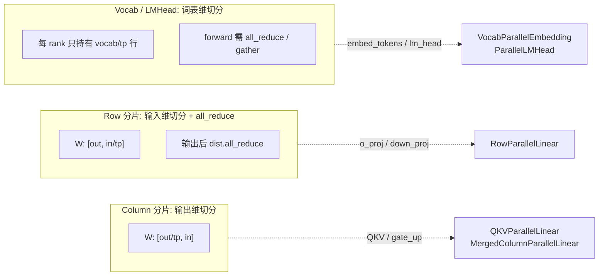
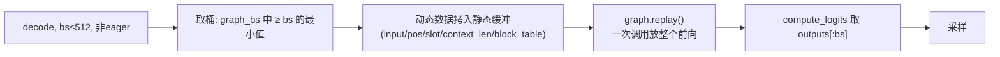
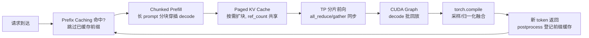

# 06 · 优化技术

Nano-vLLM 声称与 vLLM 吞吐相当，靠的就是下面这几项优化。它们的共同目标是：**让 GPU 尽可能多算、少等待**。

## 0. 优化全景

| 优化 | 代码位置 | 解决的问题 | 原理一句话 |
|------|----------|-----------|-----------|
| 连续批处理 | [scheduler.py](../nanovllm/engine/scheduler.py) | GPU 算不满 | 每步动态凑一批请求一起前向 |
| Chunked Prefill | [scheduler.py:42-52](../nanovllm/engine/scheduler.py#L42-L52) | 长 prompt 堵住 decode | 长 prompt 切块，穿插执行 |
| Paged KV Cache | [block_manager.py](../nanovllm/engine/block_manager.py) | 显存碎片/浪费 | 固定块分配 + 引用计数共享 |
| Prefix Caching | [block_manager.py:58-73](../nanovllm/engine/block_manager.py#L58-L73) | 公共前缀重复计算 | 链式哈希命中复用 |
| Tensor Parallelism | [layers/linear.py](../nanovllm/layers/linear.py) | 单卡装不下/不够快 | 权重与计算按 rank 分片 |
| CUDA Graph | [model_runner.py:223-257](../nanovllm/engine/model_runner.py#L223-L257) | Kernel 启动开销 | 把整条前向录制成一个图，回放 |
| torch.compile | [layers/sampler.py](../nanovllm/layers/sampler.py) 等 | 算子融合 | 图模式编译采样/归一化/激活 |

---

## 1. 张量并行（Tensor Parallelism）

### 1.1 分片策略

模型权重在加载时就被切成 `tp_size` 份，每个 rank 只有一部分。四类层各自的分片方式（[layers/linear.py](../nanovllm/layers/linear.py)）：



- **QKVParallelLinear**（Column 型）：把 `[q; k; v]` 的输出按头切分，`q_proj/k_proj/v_proj` 的权重经 `packed_modules_mapping` 合并后装入同一参数。
- **RowParallelLinear**（Row 型）：本地算 `y = x @ Wᵀ` 后 `all_reduce`，把各 rank 的部分和累加回完整输出。
- **VocabParallelEmbedding**：输入 token 先掩码到本 rank 的词表子区间再查表，最后 `all_reduce`。
- **ParallelLMHead**：每 rank 算本区间的 logits，最后 `dist.gather` 到 rank 0 拼成完整 logits——**这也是采样只在 rank 0 做的原因**。

### 1.2 权重加载的分片

[utils/loader.py](../nanovllm/utils/loader.py) 遍历所有 safetensors，利用每个 `nn.Parameter` 自带的 `weight_loader`（绑定在参数对象上）按 rank 切分：

```python
# packed_modules_mapping: q_proj → (qkv_proj, "q"), gate_proj → (gate_up_proj, 0) ...
for k in packed_modules_mapping:
    if k in weight_name:
        param_name = weight_name.replace(k, v)
        param.weight_loader(param, f.get_tensor(weight_name), shard_id)
```

不同的 `weight_loader` 实现分别处理：普通列切（`ColumnParallelLinear`）、带 shard_id 的合并切（`MergedColumnParallelLinear` / `QKVParallelLinear`）、行切（`RowParallelLinear`）、词表行切（`VocabParallelEmbedding`）。

### 1.3 KV Cache 也随之分片

`num_kv_heads // world_size`（[model_runner.py:110](../nanovllm/engine/model_runner.py#L110)）：每个 rank 只缓存本 rank 的注意力头需要的 K/V，避免重复缓存。

### 1.4 多卡进程模型

`tensor_parallel_size > 1` 时，rank 1..N-1 是 `spawn` 出的子进程，rank 0 通过**共享内存 + Event** 下发"运行哪一批"的指令，真正的数据交换靠 NCCL 集合通信（见 [01-architecture.md](01-architecture.md) §4）。

---

## 2. CUDA Graph

### 2.1 动机

decoder 每步只算 1 个 token，模型小而 kernel 数量多（几十上百个），**kernel 启动的 CPU 开销占比极高**。CUDA Graph 把一整套 kernel 序列录制成图，之后只调一次 `graph.replay()` 即可复放，省掉逐 kernel 启动。

### 2.2 捕获

[capture_cudagraph](../nanovllm/engine/model_runner.py#L223-L257) 只针对 **decode**（prefill 形状多变，难录制），并覆盖多个批大小：

```python
self.graph_bs = [1, 2, 4, 8] + list(range(16, max_bs + 1, 16))   # 批大小桶
for bs in reversed(self.graph_bs):
    graph = torch.cuda.CUDAGraph()
    set_context(False, slot_mapping=..., context_lens=..., block_tables=...)  # 固定形状元数据
    outputs[:bs] = self.model(...)   # warmup
    with torch.cuda.graph(graph, self.graph_pool):
        outputs[:bs] = self.model(...)   # 捕获
    self.graphs[bs] = graph
```

### 2.3 回放

[run_model](../nanovllm/engine/model_runner.py#L196-L212) 在 decode 且 `bs ≤ 512` 且非 eager 时走图路径：

```python
bs = input_ids.size(0)
graph = self.graphs[next(x for x in self.graph_bs if x >= bs)]   # 取不小于 bs 的最小桶
graph_vars["input_ids"][:bs] = input_ids                        # 拷入静态缓冲
graph_vars["slot_mapping"].fill_(-1); graph_vars["slot_mapping"][:bs] = context.slot_mapping
graph_vars["context_lens"].zero_(); graph_vars["context_lens"][:bs] = context.context_lens
graph_vars["block_tables"][:bs, :width] = context.block_tables
graph.replay()
return self.model.compute_logits(graph_vars["outputs"][:bs])
```

要点：
- **固定形状**：图的输入输出必须是固定大小的静态缓冲，所以元数据里 `slot_mapping` 等先 `fill_(-1)` / `zero_()` 再填入实际值，`-1` 槽位由 `store_kvcache` 内核的 `if slot == -1: return` 忽略。
- **共享内存池**：`torch.cuda.graph(graph, self.graph_pool)` 让不同批大小的图共享内存池，减小总内存。
- **回放后采样**：`compute_logits`（LM head 的 gather + 线性层）在 `graph.replay()` **之外**执行，因此采样可以继续走 eager 而不用进图。



---

## 3. torch.compile

对**形状固定、反复调用**的算子用 `torch.compile` 图模式编译，做算子融合与 kernel 合并：

| 算子 | 文件 | 融合内容 |
|------|------|----------|
| `Sampler.forward` | [layers/sampler.py:8](../nanovllm/layers/sampler.py#L8) | 除温度 → softmax → Gumbel-max 采样 |
| `RMSNorm.rms_forward` / `add_rms_forward` | [layers/layernorm.py:17,29](../nanovllm/layers/layernorm.py#L17) | 均值方差 + 归一化 + 乘 weight |
| `RotaryEmbedding.forward` | [layers/rotary_embedding.py:38](../nanovllm/layers/rotary_embedding.py#L38) | 查表 + 旋转复数运算 |
| `SiluAndMul.forward` | [layers/activation.py:8](../nanovllm/layers/activation.py#L8) | chunk + silu + 逐元素乘 |

> 学习提示：`@torch.compile` 对 decode 这种固定形状最有效；prefill 形状频繁变化时编译收益小、还可能触发重新编译，这也是它们集中在"固定形状算子"上的原因。

---

## 4. Chunked Prefill

**问题**：连续批处理里 prefill（计算密集）与 decode（访存密集）时长差异大。若一个超长 prompt 独占整步预算，后续 decode 全部被堵，GPU 在 prefill 完成后出现"气泡"。

**做法**（[03-scheduler.md](03-scheduler.md) §4）：把长 prompt 按 `max_num_batched_tokens` 预算切成多段，每 step 只算一段，中间穿插 decode。Nano-vLLM 只允许**队首第一个 seq** 被切，简化了多请求交错：

```mermaid
gantt
    title 无 Chunked Prefill vs Chunked Prefill
    dateFormat  X
    axisFormat  %L ms
    section 无分块
    Prefill(4096 tok)      :a1, 0, 20
    Decode                 :a2, 20, 40
    Prefill(4096 tok)      :a3, 40, 60
    Decode                 :a4, 60, 80
    section 有分块(1024/块)
    P1 :b1, 0, 5
    D1 :b2, 5, 10
    P2 :b3, 10, 15
    D2 :b4, 15, 20
    P3 :b5, 20, 25
    D3 :b6, 25, 30
    P4 :b7, 30, 35
    D4 :b8, 35, 40
```



分块后 decode 流不再被长 prefill 长时间卡住，GPU 持续有 decode 批次填充，整体吞吐与 TTFT 更稳定。

---

## 5. Prefix Caching（作为优化回顾）

链式哈希的前缀缓存（[04-paged-kvcache.md](04-paged-kvcache.md) §6-7）让三件事直接受益：

1. **多轮对话**：system prompt / 历史消息前缀命中，只算新增部分；
2. **并发相同前缀**：共享块 + `ref_count`，几乎零额外显存；
3. **抢占恢复**：被抢占的请求重新 prefill 时前缀直接复用，`cached` 块无需重算。

`can_allocate` 命中后的执行路径（[05-model-execution.md](05-model-execution.md) §5）用 `cu_seqlens_q ≠ cu_seqlens_k` + `block_tables` 表达"Q 是新 chunk、K/V 含缓存前缀"，复用 flash-attn 的变长接口一次算完。

---

## 6. 综合：一项请求的完整优化路径



这七步合起来，就是 Nano-vLLM 在 1400 行内复现 vLLM 核心吞吐能力的全部秘密。建议对照 vLLM 官方文档的 scheduler / worker / model_runner 三个目录，逐项印证本文中的简化设计。
